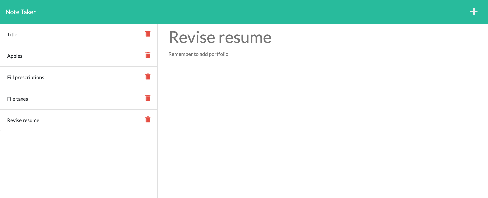

# Note-Taker Online

# Description
This application demonstrates the development of fetch routes via GET and POST methods (with further development opportunity for a DELETE method) to establish effective communication between server-side data and the application's front end. The result is essentially a digital, web-hosted notebook app which retains data on the server for future accesss on any browser.

## Table of Contents
1. [Installation](#installation)
2. [Usage](#usage)
3. [License](#license)
4. [Contributors](#contributors)
5. [Questions](#questions)
# Installation
As far as you are running the app online as intended, simply [click this link](https://rocky-bastion-27592.herokuapp.com/) to check it out! If you would like to take a closer look at the back end, you may wish to run it on your local machine. In this case, you will need to clone this repo to local, then in the parent directory, enter 'npm install' into your command line to install the requisite node modules. Then, you can run the application locally in a browser window by entering 'npm start' in your command line then navigating to 'localhost:3001' in your browser window.
# Usage
From the application home page, click "Get Started" to go to the notes page. You will see previously saved notes on the left-hand side, and a large blank field on the right, as well as a "new note (plus sign)" and "save (floppy disc icon)" button. When a title and text content are added into the corresponding fields, the note can be saved with the save button. It will then appear on the left. When a note on the left is clicked, it will become visible in expanded form on the right. Currently, the "delete (wastebin icon)" buttons aren't attached to anything, but your humble developer will endeavor to add this bonus functionality as soon as he can ;)
# License
The MIT License
# Contributors
Credits due to my course instructors Carl, Ryan, and Torre for all pitching in considerably to help solve a particularly stubborn bug. This was a valuable learning experience. Thanks guys!
# Questions
GitHub username: altavada -- Email address: sam.tomaka@gmail.com